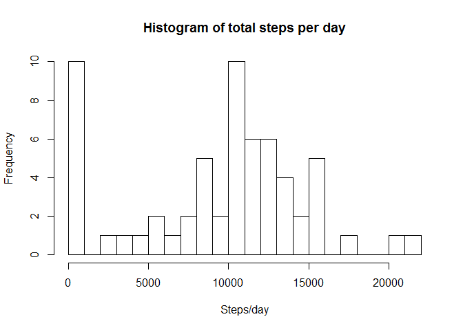
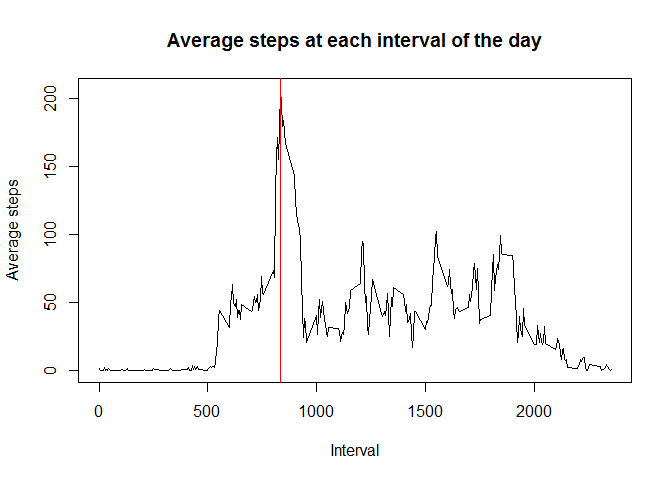
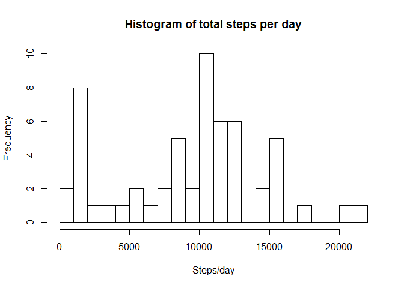

# Reproducible Research: Peer Assessment 1


## Loading and preprocessing the data
The dataset is a count of a person's walking steps measured in 5-minute 
intervals. This data is from October and November 2012.

Let's read in the data and then aggregate it into two different datasets. First,
by day (sum over all 
intervals) and, second, by interval time (average of each day at that interval).

```r
activity <- read.csv('activity.csv')

#Aggregate the step counts to each day - sum up over all intervals
activitydate <- aggregate(activity$steps, 
                          by=list(activity$date), 
                          FUN = sum, 
                          na.rm=TRUE)
names(activitydate) <- c("date","steps")

#Aggregate the step counts to each interval - take the mean of each day
activityinterval <- aggregate(activity$steps, 
                          by=list(activity$interval), 
                          FUN = mean, 
                          na.rm=TRUE)
names(activityinterval) <- c("interval","steps")
```


## What is the mean total number of steps taken per day?

Let's first view a histogram of the steps for each day.

```r
hist(activitydate$steps, 
     main = "Histogram of total steps per day", 
     xlab = "Steps/day", 
     breaks = 20)
```

 


```r
meanstepsperday <- round(mean(activitydate$steps),0)
medianstepsperday <- as.integer(round(median(activitydate$steps),0))
```

The mean total number of steps per day is 9354.
The median total number of steps per day is 10395.


## What is the average daily activity pattern?
The plot below shows the average steps for each interval in the day.

```r
plot(activityinterval$interval,
     activityinterval$steps,
     xlab = "Interval", 
     ylab= "Average steps", 
     main = "Average steps at each interval of the day",
     type = "l")

maxinterval <- activityinterval[activityinterval$steps == 
                                        max(activityinterval$steps),1]
abline(v = maxinterval, col = 'red')
```

 

The interval with the most steps on average is 835, noted with the 
red vertical line.

## Imputing missing values


```r
missingvals <- sum(is.na(activity$steps))
```

The number of missing values is 2304.

Let's make new datasets, where we fill in the NA's from 'activity' with the
average value for that interval.

```r
        #add steps2, the inputed value, to the activity set
        activity$steps2 <- activity$steps
        ind <- is.na(activity$steps2)
        ints <- activity$interval[ind]
        activity$steps2[ind] <- activityinterval$steps[ints]
```

```
## Warning in activity$steps2[ind] <- activityinterval$steps[ints]: number of
## items to replace is not a multiple of replacement length
```

```r
        #Aggregate the step counts to each day - sum up over all intervals
activitydate2 <- aggregate(activity$steps2, 
                          by=list(activity$date), 
                          FUN = sum, 
                          na.rm=TRUE)
names(activitydate2) <- c("date","steps2")

        #Aggregate the step counts to each interval - take the mean of each day
activityinterval2 <- aggregate(activity$steps2, 
                          by=list(activity$interval), 
                          FUN = mean, 
                          na.rm=TRUE)
names(activityinterval) <- c("interval","steps2")
```

Let's first view a histogram of the steps for each day.

```r
hist(activitydate2$steps2, 
     main = "Histogram of total steps per day", 
     xlab = "Steps/day", 
     breaks = 20)
```

 


```r
meansteps2perday <- round(mean(activitydate2$steps2),0)
mediansteps2perday <- as.integer(round(median(activitydate2$steps2),0))
```

The mean total number of steps per day is 9545.
The median total number of steps per day is 10395.

The  mean value is higher by almost 100 steps, but the median value is the same. 
This makes sense the median is the same, as it is the middle number, and it is 
reasonable that the missing values were above and below this value.


## Are there differences in activity patterns between weekdays and weekends?
Let's identify weekdays and weekends - Not Done
